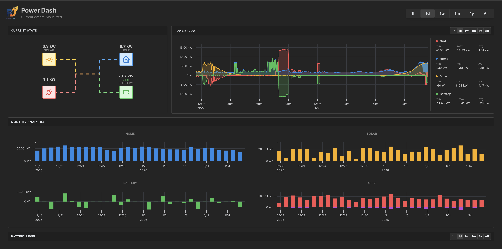
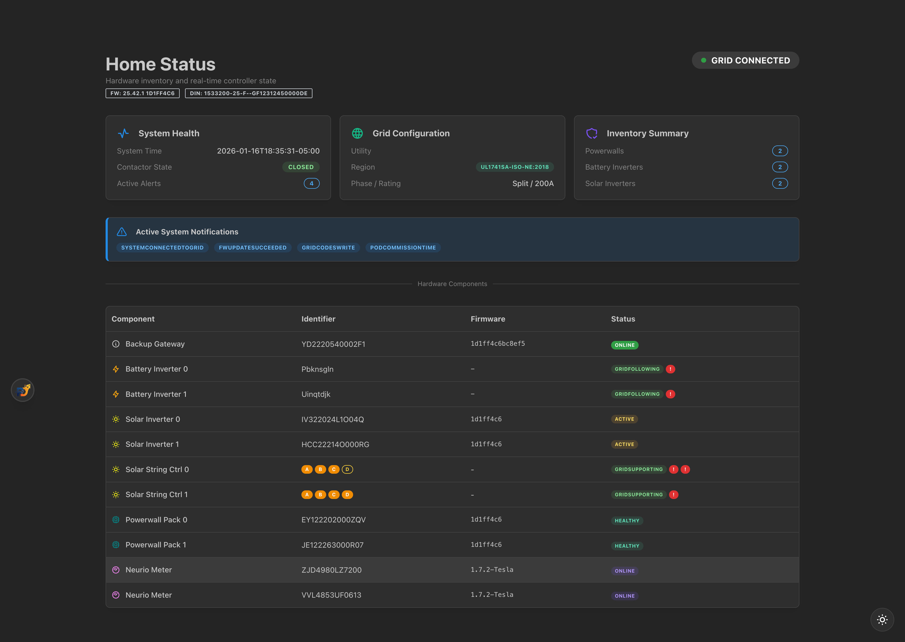
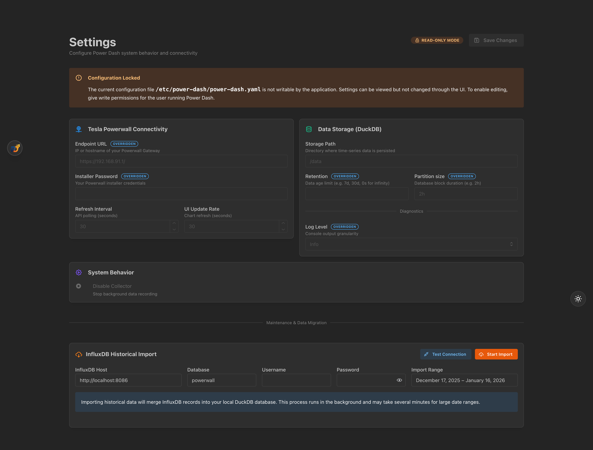

# Power Dash

> 🚧 **Work in Progress** 🚧
>
> This project is currently in **Early Alpha**. Features may change, and bugs are to be expected.

**Power Dash** is a modern, self-hosted dashboard and automation platform for the Tesla Powerwall. It acts as a high-performance bridge to your local gateway, collecting high-frequency data and presenting it in a beautiful, responsive interface.





## ✨ Features

- **⚡ Real-Time Monitoring**: Live visualization of power flow (Grid, Home, Solar, Battery) with sub-second updates.
- **🔋 Comprehensive Data**: Tracks Battery SoE, String Voltages, Inverter Health, and Grid Frequency/Voltage.
- **💾 Embedded Storage**: Built-in, high-performance time-series database (Prometheus TSDB). No external database required.
- **🚀 Modern UI**: Fast, responsive frontend built with **React**, **Mantine**, and **uPlot** for smooth zooming and panning.
- **🔌 API Proxy**: Securely proxies requests to the Powerwall API, handling authentication and session management.
- **📥 Historical Import**: Migration tools to import your existing data from InfluxDB (from _Powerwall-Dashboard_).

## 🛠️ Tech Stack

- **Backend**: Go 1.25+ (Gin, Cobra, Viper, Zap)
- **Frontend**: React 19, Mantine UI, Vite
- **Database**: Embedded Prometheus TSDB

## 🚀 Getting Started

### Prerequisites

- **Gateway Access**: Your computer must have access to `192.168.91.1`. This is typically achieved by connecting directly to the Powerwall Gateway's built-in WiFi network or by routing traffic through a device that is.
- **Installer Password**: You will need your Powerwall/Gateway password. This is usually found on the **QR sticker** located inside your gateway enclosure or on its side.

### Self-Hosting Options

#### Method 1: Docker (Recommended)

The easiest way to run Power Dash is using the official Docker image.

```bash
docker run -d \
  --name power-dash \
  -p 8080:8080 \
  -v ./data:/app/data \
  -e PASSWORD="YOUR_GATEWAY_PASSWORD" \
  -e ENDPOINT="https://192.168.91.1/" \
  ygelfand/power-dash:latest
```

#### Method 2: Standalone Binary

Download the appropriate binary for your operating system from the [Releases](https://github.com/ygelfand/power-dash/releases) page.

1. **Make Executable** (Linux/macOS):
   ```bash
   chmod +x power-dash
   ```

2. **Run**:
   ```bash
   ./power-dash run --password "YOUR_GATEWAY_PASSWORD" --endpoint "https://192.168.91.1/"
   ```

### Configuration

Power Dash can be configured via command-line flags, environment variables, or a configuration file (`power-dash.yaml`).

| Option | Flag | Environment Variable | Description |
|--------|------|----------------------|-------------|
| Endpoint | `--endpoint` | `ENDPOINT` | Gateway URL (default: `https://192.168.91.1/`) |
| Password | `--password` | `PASSWORD` | Installer password from QR sticker |
| Port | `--listen` | `LISTEN` | Address to listen on (default: `:8080`) |
| Retention | `--storage-retention` | `STORAGE_RETENTION` | Data retention period (default: `168h`) |

**Example `power-dash.yaml`:**

```yaml
endpoint: "https://192.168.91.1/"
password: "YOUR_INSTALLER_PASSWORD"
collection-interval: 5
log-level: "info"
storage:
  path: "./data"
  retention: "720h" # 30 days
```

### Running Locally (Development)

1.  **Clone the repository:**

    ```bash
    git clone https://github.com/ygelfand/power-dash.git
    cd power-dash
    ```

2.  **Build and Run:**
    You can start the backend and frontend in development mode:

    ```bash
    make run-dev
    ```

    - Backend: `http://localhost:8080`
    - Frontend: `http://localhost:8000`

3.  **Build Binary:**
    To produce a standalone binary with the UI embedded:
    ```bash
    make all
    ./bin/power-dash run --help
    ```

### Configuration

Power Dash can be configured via flags, environment variables, or a config file (`power-dash.yaml`).

**Example `power-dash.yaml`:**

```yaml
endpoint: "https://192.168.91.1/"
password: "YOUR_INSTALLER_PASSWORD"
collection-interval: 1
log-level: "info" # debug, info, warn, error
storage:
  path: "./data"
  retention: "720h" # 30 days
```

### Importing Data

Migrate from InfluxDB using the **Settings** page in the web UI or via the built-in CLI command:

```bash
# Import the last year of data via CLI
./power-dash import --influx-host "http://192.168.1.50:8086" --since "1y"
```

## 📜 License

Distributed under the MIT License. See `LICENSE` for more information.
