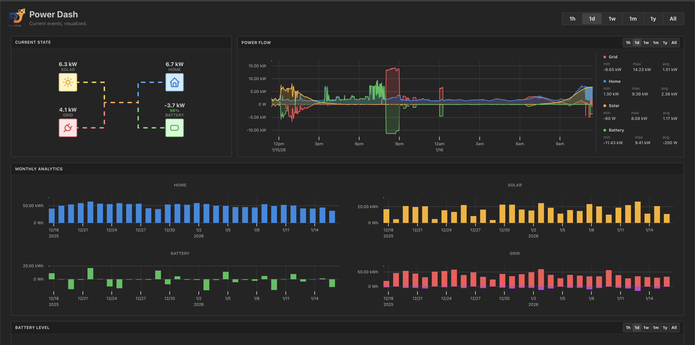
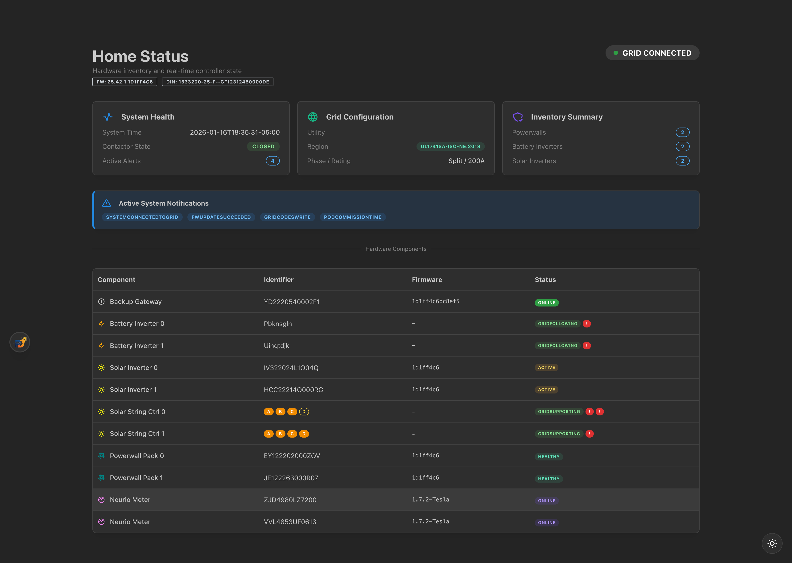
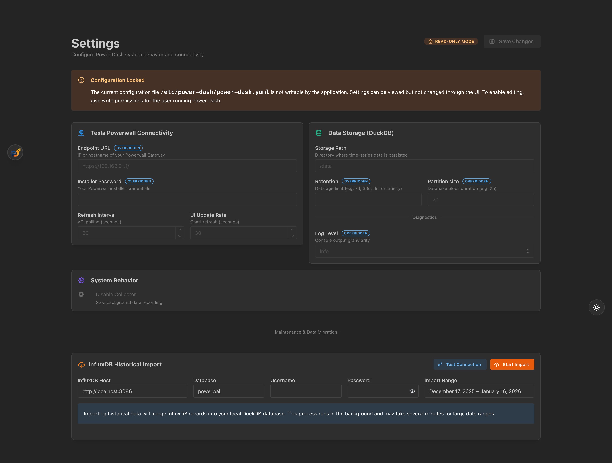

# Power Dash

> 🚧 **Work in Progress** 🚧
>
> This project is currently in **Early Alpha**. Features may change, and bugs are to be expected.

**Power Dash** is a modern, self-hosted dashboard and automation platform for the Tesla Powerwall. It acts as a high-performance bridge to your local gateway, collecting high-frequency data and presenting it in a beautiful, responsive interface.





## ✨ Features

- **⚡ Real-Time Monitoring**: Live visualization of power flow (Grid, Home, Solar, Battery) with sub-second updates.
- **🔋 Comprehensive Data**: Tracks Battery SoE, String Voltages, Inverter Health, and Grid Frequency/Voltage.
- **💾 Embedded Storage**: Built-in, high-performance time-series database (Prometheus TSDB). No external database required.
- **🚀 Modern UI**: Fast, responsive frontend built with **React**, **Mantine**, and **uPlot** for smooth zooming and panning.
- **🔌 API Proxy**: Securely proxies requests to the Powerwall API, handling authentication and session management.
- **📥 Historical Import**: Migration tools to import your existing data from InfluxDB (from _Powerwall-Dashboard_).

## 🛠️ Tech Stack

- **Backend**: Go 1.25+ (Gin, Cobra, Viper, Zap)
- **Frontend**: React 19, Mantine UI, Vite
- **Database**: Embedded Prometheus TSDB

## 🚀 Getting Started

### Self-Hosting Options

#### Method 1: Docker (Recommended)

```bash
docker run -d \
  --name power-dash \
  -p 8080:8080 \
  -v ./data:/data \
  -e POWER_DASH_PASSWORD="YOUR_GATEWAY_PASSWORD" \
  ygelfand/power-dash:latest
```

#### Method 2: Docker Compose

A `docker-compose.yml` is included in the repository:

```bash
POWER_DASH_PASSWORD=YOUR_GATEWAY_PASSWORD \
POWER_DASH_ENDPOINT=https://192.168.91.1/ \
docker-compose up -d
```

Or set the values directly in `docker-compose.yml` and run `docker-compose up -d`.

#### Method 3: Standalone Binary

Download the appropriate binary for your operating system from the [Releases](https://github.com/ygelfand/power-dash/releases) page.

```bash
chmod +x power-dash
./power-dash run --password "YOUR_GATEWAY_PASSWORD"
```

### Configuration

Power Dash can be configured via command-line flags, environment variables (`POWER_DASH_*`), or a `power-dash.yaml` file (searched in `./`, `~/.`, and `/etc/power-dash/`).

| Option              | Flag                    | Env Variable                     | Default                  |
| ------------------- | ----------------------- | -------------------------------- | ------------------------ |
| Endpoint            | `--endpoint`            | `POWER_DASH_ENDPOINT`            | `https://192.168.91.1/`  |
| Password            | `--password`            | `POWER_DASH_PASSWORD`            | _(required)_             |
| Listen address      | `--listen`              | `POWER_DASH_LISTEN`              | `:8080`                  |
| Connection mode     | `--connection-mode`     | `POWER_DASH_CONNECTION_MODE`     | `wifi`                   |
| RSA key path        | `--key-path`            | `POWER_DASH_KEY_PATH`            | `tedapi_rsa_private.pem` |
| Gateway DIN         | `--din`                 | `POWER_DASH_DIN`                 | _(auto-detected)_        |
| Collection interval | `--collection-interval` | `POWER_DASH_COLLECTION_INTERVAL` | `30` (seconds)           |
| Log level           | `--log-level`           | `POWER_DASH_LOG_LEVEL`           | `info`                   |
| Storage path        | `--storage-path`        | `POWER_DASH_STORAGE_PATH`        | `/data`                  |
| Storage retention   | `--storage-retention`   | `POWER_DASH_STORAGE_RETENTION`   | `0s` (infinite)          |

---

## 🔌 Connection Modes

Power Dash supports two ways to connect to your Powerwall gateway.

### WiFi Mode (Default)

Connect over your local network using the gateway's IP and installer password. This is the simplest setup and works for most users, but requires a device with 2 network connections:

- WiFi connected to the powerwall/gateway's internal wifi
- Wifi/LAN connected to your local network

```yaml
# power-dash.yaml
endpoint: "https://192.168.91.1/"
password: "YOUR_INSTALLER_PASSWORD"
connection-mode: wifi
```

The installer password is printed on the **QR sticker** inside your gateway enclosure.

### LAN Mode

LAN mode uses RSA-signed requests directly to the gateway's TEDAPI endpoint.

This requires a **one-time setup** using a Tesla developer account.

#### Prerequisites

- A [Tesla Developer](https://developer.tesla.com/) app with `energy_device_data` and `energy_cmds` scopes

#### Step 1: Download the binary

Download the appropriate binary for your OS from the [Releases](https://github.com/ygelfand/power-dash/releases) page and make it executable:

```bash
chmod +x power-dash
```

#### Step 2: OAuth Login

Run the interactive auth flow. This opens a browser for Tesla OAuth, starts a localtunnel for the callback, and registers your app with the Fleet API.

```bash
power-dash connect auth \
  --client-id YOUR_TESLA_CLIENT_ID \
  --client-secret YOUR_TESLA_CLIENT_SECRET
```

Tokens are saved to `fleet_tokens.json`.

#### Step 3: Register your RSA Key

This generates an RSA-4096 key pair (if one doesn't exist), registers it with your Powerwall via the Fleet API, and walks you through physical confirmation via a breaker toggle.

```bash
power-dash connect keys add
```

At the end of the command, you'll see a config snippet like:

```
┌─ Add to your config ──────────────────┐
│ connection-mode: lan                  │
│ key-path: tedapi_rsa_private.pem      │
│ din: 1234567-00-A--AA0000000000AA     │
└───────────────────────────────────────┘
```

#### Step 4: Update your config

Copy [`config/power-dash-lan.example.yaml`](config/power-dash-lan.example.yaml) to `power-dash.yaml` and fill in your values:

```yaml
endpoint: https://192.168.91.1/
password: YOUR_INSTALLER_PASSWORD
connection-mode: lan
key-path: tedapi_rsa_private.pem
din: 1234567-00-A--AA0000000000AA # from 'keys add' output
```

#### Key Management

```bash
# List registered keys and their verification state
power-dash connect keys list

# Remove a key by its base64-encoded public key
power-dash connect keys remove <PUBLIC_KEY>
```

---

## 🧑‍💻 Development

```bash
git clone https://github.com/ygelfand/power-dash.git
cd power-dash

# Start backend + frontend in dev mode
make run-dev
# Backend:  http://localhost:8080
# Frontend: http://localhost:8000

# Build standalone binary with embedded UI
make all
./bin/power-dash run --help
```

## 📥 Importing Data

Migrate from InfluxDB using the **Settings** page in the web UI.

## 📜 License

Distributed under the MIT License. See `LICENSE` for more information.
